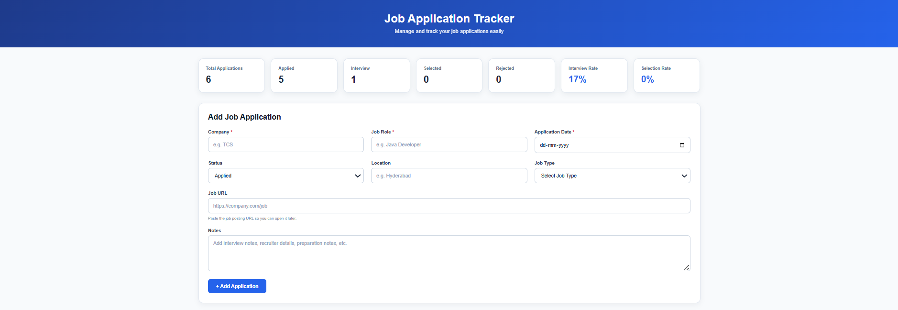
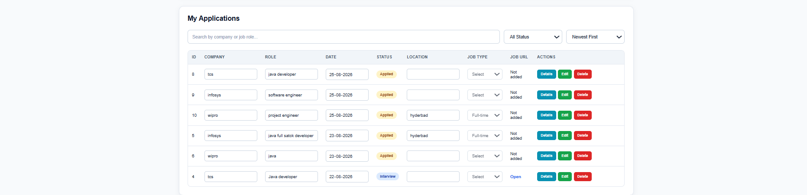

# Job Application Tracker

A full-stack web application for managing, organizing, and tracking job applications in one place.

## 📌 About the Project

The **Job Application Tracker** is a Spring Boot and MySQL-based web application designed to help users manage their job applications efficiently.

Users can add, view, edit, delete, search, filter, and sort job applications while tracking their progress through different application statuses.

The application also provides dashboard statistics such as total applications, interview rate, and selection rate.

## 🚀 Features

* Add new job applications
* View all job applications
* Edit existing applications
* Delete applications
* Search applications by company or job role
* Filter applications by status
* Sort applications by application date
* View detailed application information
* Track application status
* Calculate interview rate
* Calculate selection rate
* Backend input validation
* Global exception handling
* REST API-based backend
* Responsive and user-friendly interface
* Persistent MySQL database storage

## 📊 Dashboard

The dashboard provides an overview of job application activity, including:

* Total Applications
* Applied Applications
* Interview Applications
* Selected Applications
* Rejected Applications
* Interview Rate
* Selection Rate

## 🛠️ Technologies Used

### Backend

* Java 21
* Spring Boot
* Spring Data JPA
* REST APIs
* Maven

### Frontend

* HTML5
* CSS3
* JavaScript

### Database

* MySQL

### Tools

* Git
* GitHub
* IntelliJ IDEA / VS Code
* MySQL Workbench

## 📂 Project Structure

```text
jobtracker
│
├── src
│   ├── main
│   │   ├── java
│   │   │   └── com.example.jobtracker
│   │   │       ├── controller
│   │   │       ├── entity
│   │   │       ├── repository
│   │   │       ├── exception
│   │   │       └── JobtrackerApplication.java
│   │   │
│   │   └── resources
│   │       ├── static
│   │       └── application.properties
│   │
│   └── test
│
├── pom.xml
├── mvnw
├── mvnw.cmd
├── .gitignore
└── README.md
```

## ⚙️ How to Run the Project

### 1. Clone the repository

```bash
git clone https://github.com/bhargavidevibollavaram/jobtracker.git
```

### 2. Open the project

Open the project in IntelliJ IDEA or VS Code.

### 3. Configure MySQL

Create the required MySQL database and configure the database connection in:

```text
src/main/resources/application.properties
```

### 4. Build the project

Using Maven:

```bash
mvn clean install
```

### 5. Run the application

```bash
mvn spring-boot:run
```

The application will start on:

```text
http://localhost:8080
```
## 📸 Screenshots

### Dashboard



### Applications



## 🔗 Project Repository

GitHub:

https://github.com/bhargavidevibollavaram/jobtracker

## 🎯 Project Purpose

This project was developed to practice and demonstrate practical skills in:

* Java
* Spring Boot
* REST API development
* Spring Data JPA
* MySQL database integration
* Frontend development
* CRUD operations
* Backend validation
* Exception handling
* Git and GitHub

## 👩‍💻 Author

**Bhargavi Devi Bollavaram**

B.Tech — Computer Science and Engineering & Business Systems
